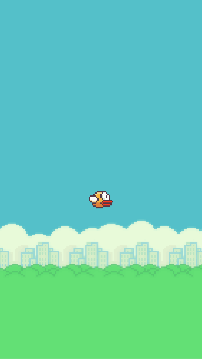

# FlappyBird
CSC59866 - Spring 2021 - Intro Project using Unity Engine

**Requirements**
- [X] Tier 1
- [X] Tier 2
- [ ] Tier 3
- [ ] Tier 4

**Overview**

- A brief overview of the the project progress
  - Game is responsive to keyboard input
  - Bird flap mechanics works
  - Pipes spawn correctly such as correctly spaced out spawn time
  - Bird dies if it comes into contact with pipe
  - Game ends appropriately when player reaches end state

- March 9, 2021
